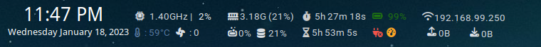

# Introduction
These are the personal conky config files and highly customize for checking Resource usage on time. Before using these config files, strongly recommend looking up the file and fixing it for your need.

There are 4 config files.
* lite_top.conkyrc 
* sky_blue.conkyrc  
* zoric.conkyrc from (https://github.com/MarkMcCoskey/ZorinConky) 
* note.conkyrc 

**The screenshots**  
With charger:   
With no charger:   

 
  
  

## Requirements
* ACPI software on Linux.
* Font Awesome 6 Free -- for showing icons in lite-top.
* cpu_power software -- for changing the power governor easily
* Nvidia driver and Nvidia settings -- for using sky_blue to show Nvidia GPU status.
* fdisk -- for getting names of HDD and SSD easily. (not necessary)
* lm_sensors -- in some tricky conditions, lm_sensors help to use `sensors` command for showing many other temps and fan speeds.
* Some cmd line to check the hardware of your pc or laptop

## Things need to know.
* You can customize the whole config setup if you know basic [conkyrc config variables](https://conky.sourceforge.net/variables.html)
* Zoric is the basic one and doesn't contain many complex codes.
* sky_blue contains many commented codes which also commented on Nvidia GPU usage, memory and GPU resources. If you want to use it, you need to uncomment these Nvidia lines.
* lite_top may be beautiful but it needs to fix a lot of positional fixes. It contains so many if-else states and complicated code. Also, icons change in some conditions.
* the note is for acting as a sticky note. 

### Customize
* If you are very good at customizing config files, you don't really need to read these customization steps. In conky, you can customize many ways for one thing. This is beauty of conky. 
* First, you need to search if is everything working by running the config file.

            conky -c lite_top.conkyrc
* Then fix which are not working. Mostly likely CPU temp, fan speed, external_hdd, battery and network may not work out of the box. Because these are specific names and not the same from computer to computer. 
* CPU, Memory, uptime and disk usage are sure to work. Because these are basic names. 
* You need to install `acpi` software to show CPU temp.   
* You need to know `hwmon` number to show CPU temp and fan speed. You can search `hwmon` by locating `/sys/class/hwmon/hwmon#`. you can find the fan number and CPU number in that.   
* If you install `acpi`, the battery percentage will work. If the battery percentage icon is not working, Change BAT1 to BAT0. 
* Power governors are advanced level and icons are set for power_save, conservative, schedutils and performance. For easily changing the power governors install `cpupower`. Then, to change the governor, type these command:  **Be careful this is sudo command**  

        sudo cpupower frequency-set -g <name_of_your_governor>
* It is for sure the internet is needed to fix. You need to edit the correct IP name to show the IP address, upload and download speed. To get the correct name type `ip addr` in your terminal and get the name. You will see `192.168.xx.xxx`, take `wlpxxx` for wifi and `enpxxx` for ethernet. 
* For disk read and write, you need to get your SSD or HDD name. Install `fdisk` and type `sudo fdisk -l` and get all of your HDD and SSD names. Then, change in `/dev/xxx` to show your disk_read and write speed. You can add multiple HDDs and SSDs.
* It is for sure icons and texts are misplaced in lite_top because of using `voffset` and `goto`. If they are misplaced. It can be easily fixed by adjusting the `voffset` and `goto`. 
*  The size and location of the conky can be changed `alignment`. 
*  If you don't want to show conky in every tag or window just remove `sticky` in `own_window_hints`.
*  For size, you can adjust the `minimum_height`, `minimum_width`, `maximum_width`.
* If you want to add MPD player and other fancy things, just google, take the example conky you like and fix the code. There are plenty of beautiful conkys out there. even in the original conky GitHub. 
#  Enjoy your conky. 