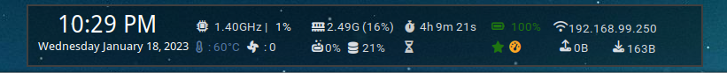
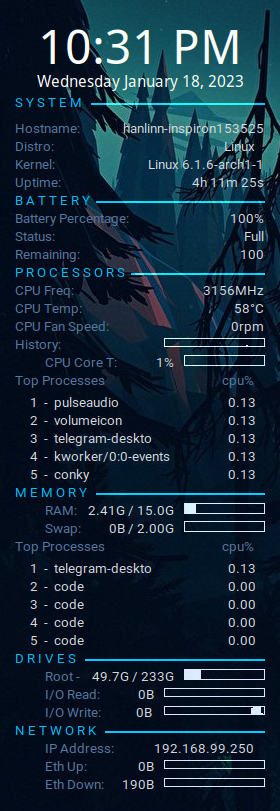
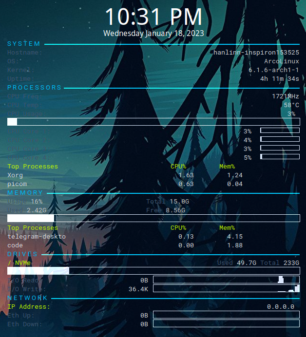
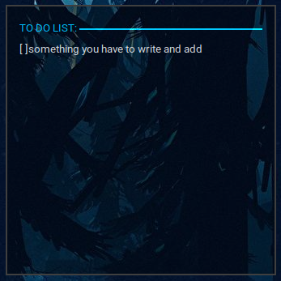
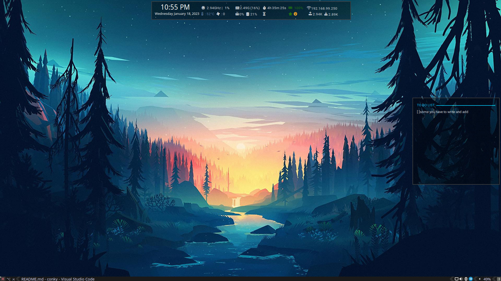

# Introduction
These are the personal conky config files and highly customize for checking Resource usage on time. Before using these config files, highly recommend looking up the file and fixing it for your need.

There are 4 config files.
* lite_top.conkyrc 
* sky_blue.conkyrc
* zoric.conkyrc
* note.conkyrc 

**The screenshots**

## Requirements
* ACPI software on Linux.
* Font Awesome 6 Free -- for showing icons in lite-top.
* Some cmd line to check the hardware of your pc or laptop

## Note
* You can customize the whole config setup if you know basic [conkyrc config variables](https://conky.sourceforge.net/variables.html)
* Zoric is the basic one and doesn't contain much complex code.
* sky_blue contains commented codes which also Nvidia GPU usage, memory and GPU resources. 
* lite_top may be beautiful but it needs to fix a lot of positional fixes. It contains so many if-else state and change icons in some condition.
* the note is for a sticky note 

### Customize
First, you need to search if is everything working by running the config file.

            conky -c lite_top.conkyrc
Then fix which are not working. Mostly likely CPU temp, fan speed, external_hdd, battery and network may not work out of the box. CPU, Memory, uptime and disk usage are sure to work. 
You need to install `acpi` software to show CPU temp.   
You need to know `hwmon` to show CPU temp and fan speed. You can search `hwmon` by locating `/sys/class/hwmon/hwmon#`. you can find the fan number and CPU number in that.   
If you install `acpi`, the battery percentage will work. If the battery percentage icons is not working, Change BAT1 to BAT0. 

